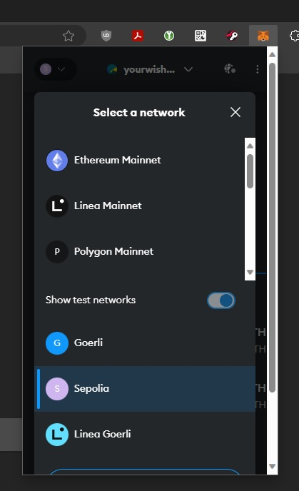
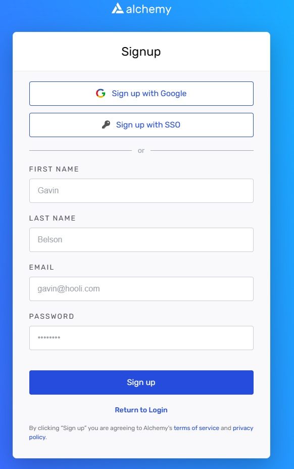
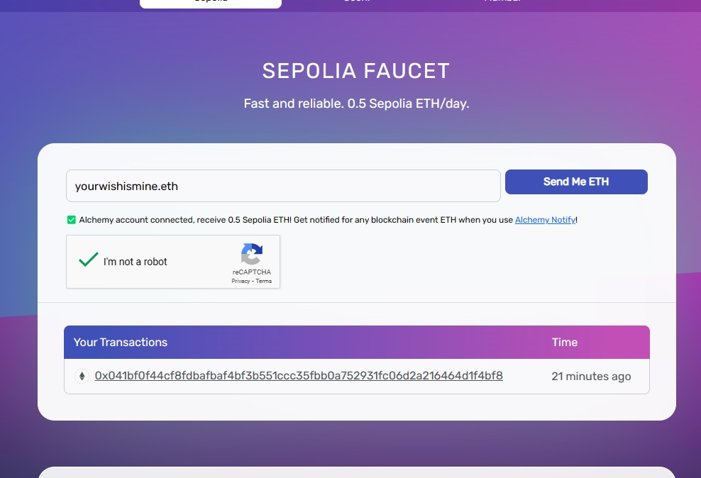
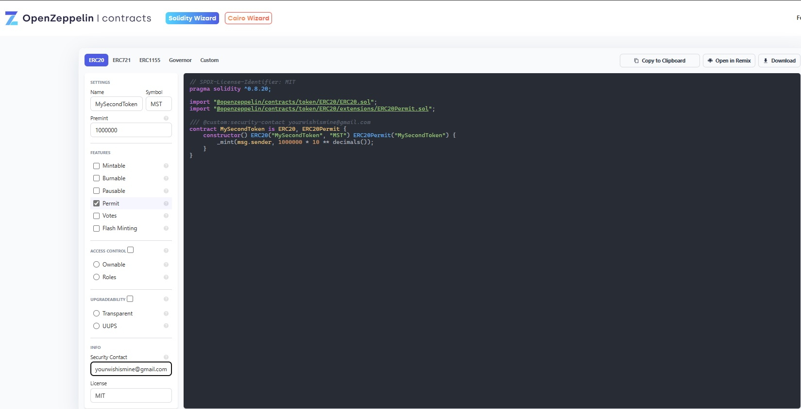

<base target="_blank">

# EVM-Create-Tokens
 Create tokens on any of the EVM blockchains
* Install MetaMask in your webbrowser if you haven't already
<!-- links -->
>> [MetaMask - Download](https://metamask.io/download)
<!-- links -->
>> [setup MetaMask](https://support.metamask.io/hc/en-us/articles/360015489531-Getting-Started-With-MetaMask)
* click MetaMask and make sure you have the Sepolia network selected
<!--Images-->

* goto Alchemy and sign up for a free account to be able to use their free Sepolia test network ETH
<!-- links -->
>> [Alchemy - Signup](https://auth.alchemy.com/signup)
<!--Images-->

* goto the Sepolia Faucet and faucet some free Sepolia ETH
<!-- links -->
>> [Sepolia Faucet](https://sepoliafaucet.com)
<!--Images-->

* goto OpenZepplin's wizard page
<!-- links -->
>> [OpenZepplin - Wizard](https://wizard.openzeppelin.com)
* Fill in the following
    1. Name
    1. Symbol
    1. Premint
    1. Security Contact
* click 'Open in Remix'
<!--Images-->



<!--Images-->

* Click ***Yes, do it!***
<!--Images-->

* in a Terminal window
<!-- Bash script block -->
```bash
mkdir MyPythonBot
cd MyPythonBot/
touch requirements.txt
touch .env
touch bot.py
nano .env
```
* In the Discord Developer Portal click ***Copy*** to copy your bot's private TOKEN (always keep this private)
<!--Images-->

* back in the terminal (nano still open)
```
TOKEN=<paste your copied token here>
```
* In the Discord Developer Portal
<!--Ordered List -->
>>1. click ***OAuth2***
>>2. click ***URL Generator***
>>3. click ***bot***
>>4. check the ***Administrator*** check box
>>5. click ***Copy***
<!--Images-->

* back in the terminal (nano still open)
```
TOKEN=<paste your copied token here>
INVITE_URL=<paste the copied URL here>
```
* open a new TAB in your Web-Browser and paste the copied URL in the Address bar of the new TAB (don't press ENTER)
* click back to the Discord Developer Portal TAB
* In the Discord Developer Portal (see image below showing steps in Developer Portal)
<!--Ordered List -->
>>1. click ***General Information***
>>2. click ***Copy*** button under ***APPLICATION ID***
* back in the terminal (nano still open)
```
TOKEN=<paste your copied token here>
INVITE_URL=<paste the copied URL here>
APPLICATION_ID=<paste copied APPICATION ID here>
```
* In the Discord Developer Portal
>>3. click ***Copy*** button under ***PUBLIC_KEY***
* back in the terminal (nano still open)
```
TOKEN=<paste your copied token here>
INVITE_URL=<paste the copied URL here>
APPLICATION_ID=<paste copied APPICATION ID here>
PUBLIC_KEY=<paste your copied PUBLIC_KEY here>
```
>>4. CTRL+O -> ENTER -> CTRL+X
<!--Images-->

* Create a Discord Server (also known as a Guild)
<!-- links -->
>> [Discord - Create a server](https://support.discord.com/hc/en-us/articles/204849977-How-do-I-create-a-server-)
* click the new TAB you opened earlier in your Web-Browser and click enter on the Address you pasted in the Address bar
>> Choose your server from the Drop-Down box then click ***Continue***
<!--Images-->

>> Click ***Authorize***
<!--Images-->

* The bot (which still needs the code written for) should now be OFFLINE on your server, next we will write the code to make the bot perform
<!--Images-->

* back in the terminal
<!-- Bash script block -->
```bash
sudo apt --yes install python3-pip
pip install --upgrade python-dotenv
pip install --upgrade discord.py
echo 'export PATH="/home/<your Username>/.local/bin:$PATH"' >> ~/.bashrc
source ~/.bashrc
nano bot.py
```
```python
import os
import random
import discord
from dotenv import load_dotenv

load_dotenv()
TOKEN = os.getenv('TOKEN')
INVITE_URL = os.getenv('INVITE_URL')
APPLICATION_ID = os.getenv('APPLICATION_ID')
PUBLIC_KEY = os.getenv('PUBLIC_KEY')

intents = discord.Intents().all()
client = discord.Client(intents=intents)

@client.event
async def on_ready():
    print(f'{client.user} has connected to Discord!')

@client.event
async def on_message(message):
    if message.author == client.user:
        return

    hello = [
        'Hello, {}.'.format(message.author.name),
        'Good Morning, {}.'.format(message.author.name),
        'Good Evening, {}.'.format(message.author.name)
    ]

    if message.content == 'hello':
        response = random.choice(hello)
        await message.channel.send(response)
        print(response)

client.run(TOKEN)
```
```bash
> CTRL+O -> ENTER -> CTRL+X
python bot.py
```
### Congratulations, on making your first Discord bot in Python
#### Notes
<!-- links -->
* [Discord - Developer Docs](https://discord.com/developers/docs/intro)
* [Discord - Developer Server](https://discord.gg/discord-developers)
* [Discord Intents Calculator](https://discord-intents-calculator.vercel.app)
* [discord.py](https://discordpy.readthedocs.io/en/latest/)
* Tested on Ubuntu 22.04 on 2023-10-01
* Recommend using VSCode instead of nano
<!-- links -->
* [Visual Studio Code (VSCode)](https://code.visualstudio.com/download)
* This isn't meant to be a Python course, for an introductory Python Course see the link below
<!-- links -->
* [Programming with Mosh - Python for Beginners](https://www.youtube.com/watch?v=kqtD5dpn9C8)
* For getting Python setup on your Computer, see my Getting Started tutorial here
<!-- links -->
* [Python - Getting Started](https://github.com/yourwishismine1989/Python_Getting-Started)