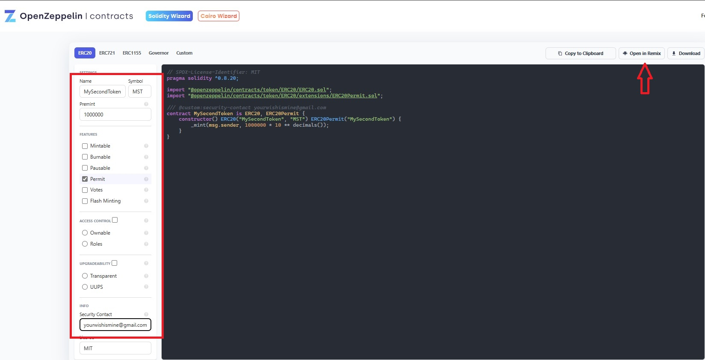
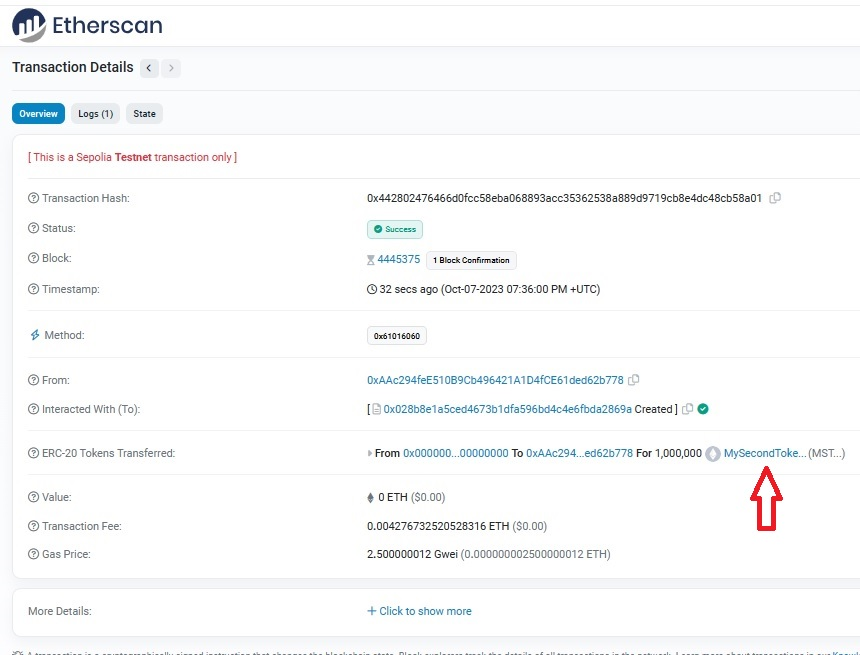

<base target="_blank">

# EVM-Create-Tokens
 Create tokens on any of the EVM blockchains
* Install MetaMask in your webbrowser if you haven't already
<!-- links -->
>> [MetaMask - Download](https://metamask.io/download)
<!-- links -->
>> [setup MetaMask](https://support.metamask.io/hc/en-us/articles/360015489531-Getting-Started-With-MetaMask)
* click MetaMask and make sure you have the Sepolia network selected
<!--Images-->

* goto Alchemy and sign up for a free account to be able to use their free Sepolia test network ETH
<!-- links -->
>> [Alchemy - Signup](https://auth.alchemy.com/signup)
<!--Images-->

* goto the Sepolia Faucet and faucet some free Sepolia ETH
<!-- links -->
>> [Sepolia Faucet](https://sepoliafaucet.com)
<!--Images-->

* goto OpenZepplin's wizard page
<!-- links -->
>> [OpenZepplin - Wizard](https://wizard.openzeppelin.com)
* Fill in the following
    1. Name
    1. Symbol
    1. Premint
    1. Security Contact
* click 'Open in Remix'
<!--Images-->

* in Remix click Compile contract-blahblah (blahblah will be numbers and letters)
<!--Images-->

* click 'Deploy & run transactions' symbol on the left
<!--Images-->

* choose 'Injected Provider - MetaMask' in the ENVIRONMENT drop-down on the left
<!--Images-->

* make sure the correct wallet is selected (if you have more than 1 in MetaMask), then click Next
<!--Images-->

* click Connect
<!--Images-->

* click Deploy on the left
<!--Images-->

* click Confirm on MetaMask
<!--Images-->

* wait for Remix to show the green check mark on the bottom signifying that your contract has been deployed
* click view on ehterscan (just above the green check mark)
<!--Images-->

* you new token has been deploy, congratulations, now for importing it into your MetaMask
* click your Token name on the Etherscan page
<!--Images-->

* click the copy icon on your Tokens contract page
<!--Images-->

* back in MetaMask, click the 'Import tokens' link
<!--Images-->

* paste the contract that you copied to your clipboard and click the 'Add custom token' button
<!--Images-->

* click 'Import tokens' button
<!--Images-->

* you should now see your custom token in MetaMask
<!--Images-->

### Congratulations, on making your first custom token on the Sepolia ETH test network
#### Notes
* This demonstrates using the Sepolia ETH test network, but will work on any of the EVM test network or their main networks (BNB, ETH, POLYGON, etc.)
